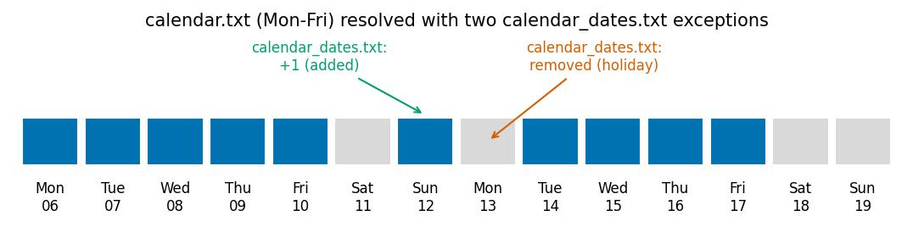

# Calendar Handling

Source: `pyGTFSHandler/models/calendar.py`.

## Design principle: no row duplication

GTFS defines two, potentially overlapping, sources of truth for "is service
`X` running on date `D`":

- **`calendar.txt`** — a weekday pattern (`monday`…`sunday`) valid within
  `[start_date, end_date]`.
- **`calendar_dates.txt`** — single-date exceptions, either adding
  (`exception_type=1`) or removing (`exception_type=2`) a `service_id` on one
  specific date.

An earlier version of this module duplicated every calendar row into a second,
`"_night"`-suffixed copy shifted `+1` day, as an approximation for services
that run past midnight. `pyGTFSHandler` no longer does this: both files are
parsed and kept **exactly as authored** — dates converted to integer
days-since-epoch, but no row duplication and no date shifting.

Correct handling of overnight/multi-day trips instead lives entirely in
`stop_times.txt`'s `day_offset` column (see `models/stop_times.py`): a
stop_time's *real* calendar date is

$$
\text{real_date} = \text{service_date} + \text{day_offset}
$$

resolved at query time by `Feed.filter_by_date`/`filter_by_date_range`, which
check, for each distinct `day_offset` value present, whether the service is
active on `queried_date - day_offset`. `Calendar` itself has no awareness of
`day_offset` — it only ever answers "which `service_id`s are active on date
`X`".

## Resolving active services for a single date

`Calendar.get_services_in_date(date)`:

1. From `calendar.txt`: services where `weekday(date) == 1` and
   `start_date ≤ date ≤ end_date`.
2. From `calendar_dates.txt`: services with `exception_type=2` on `date` are
   **removed**; services with `exception_type=1` on `date` are **added**.
3. Final result:

$$
\text{active}(D) = \big(\text{Calendar}(D) \cup \text{Added}(D)\big) \setminus \text{Removed}(D)
$$

## Resolving active services over a date range

`Calendar.get_services_in_date_range(start_date, end_date, date_type=None, lon=None, lat=None)`
does the same resolution independently for every date in
`[start_date, end_date]`, returning one row per date with the sorted list of
active `service_id`s (`date`, `weekday`, `service_ids`).

`Feed`'s constructor calls this with the requested window widened by one day
at the start (`start_date - timedelta(days=1)`) specifically so that services
whose *last* stop_time falls after midnight on the day before `start_date`
(i.e. `day_offset=1` relative to that prior date) are still picked up.

## Date-type classification (`weekday`/`weekend`/`holiday`/...)

`Calendar.filter_by_date_type(result, date_type, lon, lat)` filters the
per-date `service_ids` table down to dates matching one or more of:
`workday`/`businessday`, `holiday`, `non_workday`/`non_businessday`, `weekday`,
`weekend`/`non_weekday`, or a specific weekday name. Multiple `date_type`
values are combined with AND semantics.

- `weekend` is computed purely from the weekday name — no network access.
- `holiday` (and anything derived from it — `workday`, `non_workday`, ...)
  additionally calls `Calendar.add_holidays_and_weekends`, which:
  1. Resolves a country/subdivision from `(lat, lon)` via
     `utils.geocoding.get_country_region` (the *mean* stop coordinate of the
     loaded feed, computed once in `Stops.load`).
  2. Fetches a holiday calendar per distinct year present in the data
     (`utils.date_parsing.get_holidays`).
  3. Flags each date as `holiday` if it appears in that calendar.

This split matters because `Feed` reuses `filter_by_date_type` to classify a
stop_time's *offset-adjusted real date* (not its nominal `service_date`) — a
trip departing at 25:30 on a Friday's `service_id` might really run into
Saturday, and should be classified as a weekend departure if `date_type`
requests one, which is exactly what threading the resolved real date back
through this same function achieves.

## Mutating calendar bounds

`Feed.calendar_new_start_date`/`calendar_new_end_date` overwrite
`start_date`/`end_date` directly on the loaded `calendar.txt` LazyFrame — for
one source file (`file_id`), one named feed (`gtfs_name`), or globally — used
when combining/aligning several historical GTFS snapshots without re-reading
from disk.
