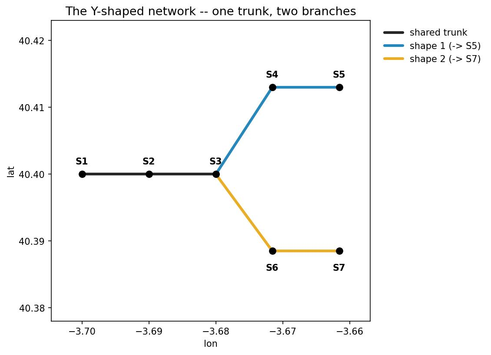
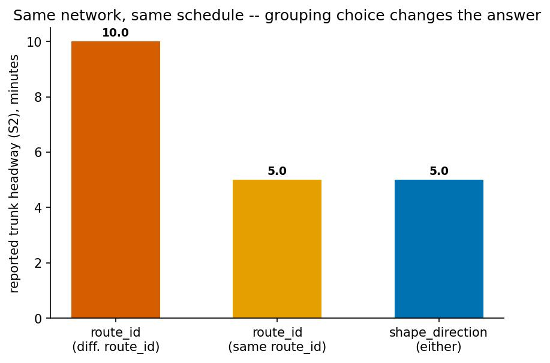
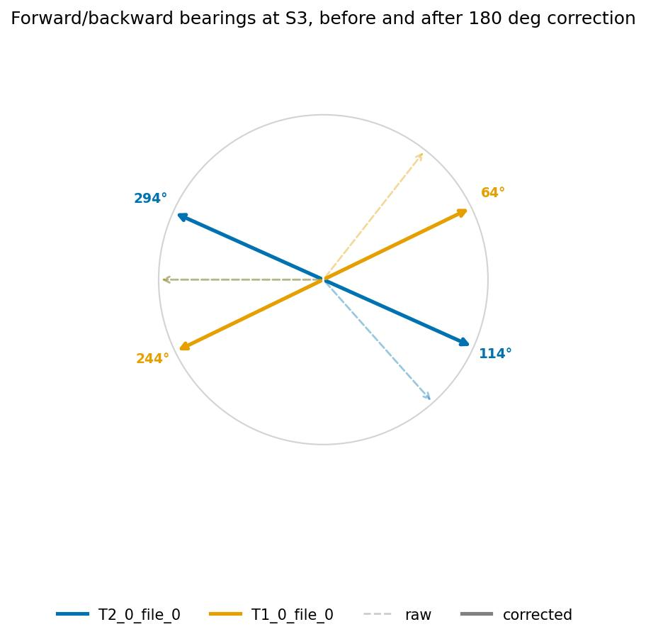
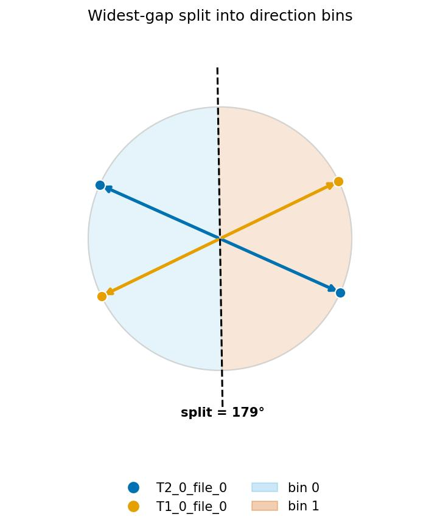
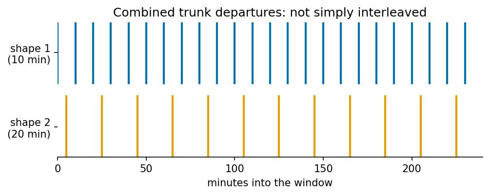

# Direction & Headway Methodology

For the full worked figures, run the companion notebooks: see
[Examples](../examples/direction_and_headway_methodology.ipynb) and
`examples/direction_conflicts.ipynb`.

## Why not just use `route_id`/`direction_id`?

A naive headway calculation grouped `by="route_id"` gives an answer that
depends on an incidental data-modeling choice, not on the actual network
geometry. In the notebooks' worked Y-shaped network (trunk `S1→S2→S3`,
branches `S3→S4→S5` and `S3→S6→S7`, each branch running every 10 minutes
offset by 5 minutes) the *same* physical trunk headway is reported as:

- **10 minutes**, if the two branches are modeled as two different
  `route_id`s (not combined — each counted separately).
- **5 minutes**, if the two branches happen to share one `route_id` (combined).

`pyGTFSHandler` instead offers `by="shape_direction"`, which clusters trips by
their actual geometric bearing at a stop, giving the correct combined **5
minutes** regardless of how routes happen to be numbered in the source feed.

## 1. Reconciling forward/backward bearings at a stop

At a stop that a shape merely passes through, its incoming ("forward") and
outgoing ("backward") bearing should be exactly 180° apart — in practice they
rarely are (uneven `shape_pt_sequence` spacing, curved segments, GPS noise).

`_reconcile_fwd_bwd(fwd, bwd, method="both")` rotates both bearings toward
each other until they are exactly 180° apart, splitting the correction:

- `method="both"` (default): the correction is split 50/50 between forward
  and backward.
- `method="forward"`: forward is trusted as-is; backward absorbs the full
  correction.
- `method="backward"`: backward is trusted as-is; forward absorbs the full
  correction.

Neither raw reading is assumed more trustworthy by default — hence the 50/50
split.

## 2. Clustering bearings into direction bins: the widest-gap split

Once every shape passing through a stop has a (corrected) forward/backward
bearing pair, `_widest_gap_split` clusters all of them into two local bins
(`0`/`1`) by finding the widest angular gap on the compass circle and
splitting at its midpoint:

$$
\text{boundary} = \theta_i + \frac{\theta_{i+1} - \theta_i}{2}, \qquad
i = \underset{i}{\arg\max}\,(\theta_{i+1} - \theta_i)
$$

for bearings sorted $\theta_1 < \dots < \theta_n$ (with
$\theta_{n+1} = \theta_1 + 360°$ wrapping around).

**Both** the forward and backward point of every shape are added to this pool
— not just one per shape. This matters: two shapes traveling the *same* real
direction through a stop (bearings a fraction of a degree apart from
geometry/GPS noise) would otherwise risk a spurious split between their two
near-duplicate points; adding each shape's antipodal (reconciled backward)
point too fills in the far side of the circle, so a genuinely small gap
between near-duplicates is never mistaken for the widest gap. A stop with a
real two-direction split (e.g. outbound ~95-100°, inbound ~275-280°) is
correctly separated either way.

### Generalizing to *n* directions

`n_divisions=k` requests $2k$ sectors around the same split boundary:

$$
\text{sector}(\theta) = \left\lfloor \frac{\big((\theta - \text{split}) \bmod 360°\big) \cdot 2k}{360°} \right\rfloor
$$

(for even $k$, the boundary is additionally offset by $90°/k$). `k=1` recovers
the plain 2-bin case above. Increasing `n_divisions` only helps when the
underlying bearings actually spread across more of the compass — a stop where
every shape's bearing sits within the same half-circle (e.g. two branches off
one shared trunk, both capped under 90° apart by reconciliation against the
same trunk backward-bearing) reports the *same* single combined bin
regardless of `n_divisions=1/2/3`. Splitting such a stop further needs the
`method` parameter (below), or more shapes present (e.g. the reverse-direction
trips), not a higher `n_divisions`.

## 3. From per-stop bins to a route-wide `direction_id`

A stop's local `0`/`1` bin only means something *at that stop* — nothing ties
"0" at one stop to "0" at another. `Shapes._assign_direction_ids_for_route`
reconciles this across an entire route:

1. Pick the stop with the most distinct `shape_id`s present as the
   **anchor** — its local labels become the route's canonical `direction_id`
   values.
2. Walk every other stop, fewest distinct shapes first; at each stop, choose
   whichever of {keep local labels, flip both labels} agrees with more
   already-resolved shapes.
3. Once every stop has been walked, each `shape_id` collapses to a single
   `direction_id`: the majority value across all the stops it passes through.
   Any stop where that shape's *local* reading disagreed with the majority is
   flagged `direction_conflict=True` — this is a genuine branching ambiguity
   in the network, not a bug. The shape's actual local reading at a flagged
   stop is recoverable as `1 - direction_id`.

An unresolvable conflict is mathematically impossible with only two shapes
present at a stop (2 points always define exactly 2 gaps whose midpoints are
180° apart, trivially reconciled). A genuine conflict needs an **odd cycle**
in the stop-to-stop reconciliation graph, which needs at least 3 shapes — e.g.
a route that branches, backtracks over a shared segment, and continues,
combined with its own reverse-direction trip.

`maps.conflict_map(feed)` renders every stop with at least one
`direction_conflict=True` row as a flagged marker, and highlights a
conflicting shape's own stop markers when a route is selected.

## 4. Headway ("mean interval") at stops

`FeedAnalysisMixin.get_headway_at_stops` (and the edge-level counterpart,
`FeedEdgeAnalysisMixin.get_headway_at_edges`) summarize a stop's departure
times within a `[start, end]` window into a single "headway" number. This is
**not** a plain average of the gaps between departures — it is an RMS-style
statistic that penalizes irregular spacing more than a plain average would.

For sorted departures $d_1 < d_2 < \dots < d_n$ within
$[\text{start}, \text{end}]$, define the wrap-around gap that combines the
wait before the first departure and the wait after the last one:

$$
g_0 = (d_1 - \text{start}) + (\text{end} - d_n)
$$

and the interior gaps $g_i = d_i - d_{i-1}$ for $i = 2, \dots, n$. Then:

$$
\text{headway} = \frac{g_0^2 + \sum_{i=2}^{n} g_i^2}{\text{end} - \text{start}}
$$

Three schedules with the *same* average gap (600s, i.e. one bus every 10
minutes on average across 6 departures/hour) score very differently:

| Schedule | Departures (s) | Plain mean gap | RMS headway |
|---|---|---|---|
| perfectly regular | 0, 600, 1200, 1800, 2400, 3000, 3600 | 600s | 600s |
| one big gap | 0, 120, 240, 360, 480, 600, 3600 | 600s | much larger |
| bursty (clustered) | 0, 60, 120, 180, 3300, 3360, 3600 | 600s | much larger |

Squaring (RMS, not mean) reflects the *inspection paradox*: a rider arriving
at a random time is more likely to land inside a long gap, so long gaps should
weigh more than short ones of the same total duration.

### Combining two independent, differently-timed services

Pooling two services with different, but commensurate, headways is **not**
their plain average or their harmonic mean under random-phase assumptions —
because their relative phase is fixed and known, not random. Example: shape 1
every 10 minutes from t=0, shape 2 every 20 minutes from t=5 (5-minute
offset), over a long window. The combined departures repeat exactly every
$\mathrm{lcm}(10, 20) = 20$ minutes with gap pattern `[5, 5, 10]` (minutes), so:

$$
\text{headway} = \frac{5^2 + 5^2 + 10^2}{5+5+10} = 7.5 \text{ min}
$$

— smaller than either service alone (pooling more services should mean more
frequent overall service), but neither the naive average (`(10+20)/2 = 15`)
nor the random-phase harmonic combination ($1/(1/10+1/20) \approx 6.67$).

### `how`: combining sectors at a stop

`get_headway_at_stops`/`get_headway_at_edges` tag each direction sector `i`
with `shape_direction_group_id = i % n_divisions`, so a sector and its
diametrically opposite sector (same physical road, outbound vs. inbound)
always share one `group_id`. `how` controls what happens next:

- `"all"`: ignore grouping — return every sector's own headway as its own
  row.
- `"best"`: collapse the whole stop to one row — the single smallest headway
  across every sector, any direction.
- `"add"` (`mix_directions=False`): first take the best (smallest) headway
  *within* each `group_id` (so outbound and inbound at the same physical
  segment are never combined with each other), then harmonic-combine
  *across* groups:

$$
\text{headway}_{\text{combined}} = \left(\sum_{g} \frac{1}{\text{headway}_g}\right)^{-1}
$$

`"add"` is the only mode that treats different `group_id`s (genuinely
different, combinable services through the same stop) as poolable, while
never blending two shapes that are alternatives for a rider in only one of
those directions.

## Grounding: where to see this run

`examples/direction_and_headway_methodology.ipynb` walks all of the above on a
synthetic Y-shaped network and closes with a real Sevilla (TUSSAM) feed
headway map. `examples/direction_conflicts.ipynb` walks the conflict-graph
case (odd-cycle example) and the `conflict_map`/route-map visualizations in
detail.
