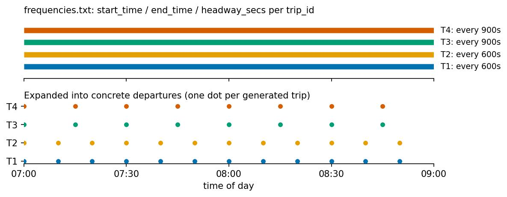

# Frequency-Based Trip Expansion

Source: `pyGTFSHandler/models/frequencies.py` (`FrequenciesMixin`, mixed into
`StopTimes`) and `pyGTFSHandler/feed.py`'s `Feed._frequencies_to_stop_times`.

`frequencies.txt` declares that a "template" trip (one that already has a full
row-per-stop pattern in `stop_times.txt`) actually repeats every `headway_secs`
seconds between `start_time` and `end_time`, rather than running just once.
`pyGTFSHandler` expands this into concrete, individually addressable departures.



!!! note "`Feed.filter`'s `frequencies` flag"
    `Feed.filter(..., frequencies=...)` is the *keep-as-template* switch, not
    an "expand" switch: `frequencies=True` (the default) leaves
    `frequencies.txt`-defined trips as unexpanded templates, and
    `frequencies=False` is what calls `_frequencies_to_stop_times` and
    produces the concrete per-departure rows shown above.

## 1. Reading and window reconciliation

`_read_frequencies` parses `start_time`/`end_time` into seconds-since-midnight
(supporting values ≥ 24:00:00 for windows that run past midnight) and tags
every row with its `orig_trip_id`.

Because a single trip can have several `frequencies.txt` windows covering
different parts of the day, `_reconcile_frequency_windows` walks each trip's
chain of windows (sorted by `start_time`) and aligns adjacent windows onto a
clean grid:

- If a window's `(end_time - start_time)` is already an exact multiple of its
  own `headway_secs`, it is left untouched.
- Otherwise `end_time` is pushed up to the next exact multiple:

$$
\text{end_time}' = \text{start_time} + \left\lceil \frac{\text{end_time} - \text{start_time}}{\text{headway_secs}} \right\rceil \cdot \text{headway_secs}
$$

- If that push moves `end_time'` past the *next* window's `start_time`, the
  next window's `start_time` is pulled forward to match (and, if `end_time'`
  reaches or passes the next window's own `end_time`, that next window
  collapses entirely) — so a trip's full day of frequency windows always
  tiles with no overlaps and no dangling, unreachable trailing period.

Windows whose time range crosses midnight are first split into two separate
per-day `trip_id` chains before this reconciliation runs, so no single chain
handled by `_reconcile_frequency_windows` itself crosses midnight.

## 2. Aligning departures to the stop template's own timing

Each `frequencies.txt` row is matched against its trip's `stop_times.txt`
template, which already has a `departure_time` for the first stop and a
`shape_time_traveled` offset (elapsed time since the first stop) for every
other stop.

`Feed._frequencies_to_stop_times` generates concrete departures by first
aligning the requested window start to the template trip's own first-stop
departure time, so generated instances land on a clean grid that includes the
template's original timing rather than an arbitrary multiple of `start_time`:

$$
\text{aligned_start} = \left\lceil \frac{\text{start_time} - \text{departure_time}_{\text{first stop}} + \text{shape_time_traveled}}{\text{headway_secs}} \right\rceil \cdot \text{headway_secs} + \text{departure_time}_{\text{first stop}}
$$

Then, for every stop of the template, new departure times are generated on the
regular grid

$$
\{\, \text{aligned_start} + k \cdot \text{headway_secs} \;:\; k = 0, 1, 2, \dots \,\} \quad \text{while} \quad \text{aligned_start} + k\cdot\text{headway_secs} < \text{end_time} + \text{shape_time_traveled}
$$

i.e. `pl.int_ranges(aligned_start, end_time + shape_time_traveled,
headway_secs)`, one range per (trip, stop) row, then exploded into one row per
generated departure.

## 3. New trip IDs and arrival/departure shift

Each generated instance gets its own synthetic `trip_id`:

```
{original_trip_id}_{k}
```

where `k = ceil((new_departure_time - start_time - shape_time_traveled) / headway_secs)`
identifies which repetition of the template this row is. The stop's
`arrival_time` is shifted by the same delta as `departure_time` so the
template's original dwell time (`arrival_time - departure_time` at that stop)
is preserved:

$$
\text{arrival_time}' = \text{arrival_time} - \text{departure_time} + \text{new_departure_time}
$$

Rows whose `start_time` is null (i.e. trips that were never referenced by
`frequencies.txt`) pass through this step unchanged, with `new_departure_time`
simply set to the existing `departure_time`. After expansion, every row gets
`n_trips = 1` (one physical departure) and `start_time`/`end_time`/
`headway_secs` are cleared, since those columns no longer apply once a
concrete departure time exists.

## Interaction with midnight crossing

The window-splitting step in section 1 and the `day_offset` handling described
in [Calendar handling](calendar.md) work together: a `frequencies.txt` window
that spans midnight is split at the day boundary into two chains before
expansion, and each expanded departure inherits the correct `day_offset` from
its half of the split — so a service starting at 23:00 with a 30-minute
headway through 02:00 the next day produces departures correctly attributed to
either the original service date or the following one.
